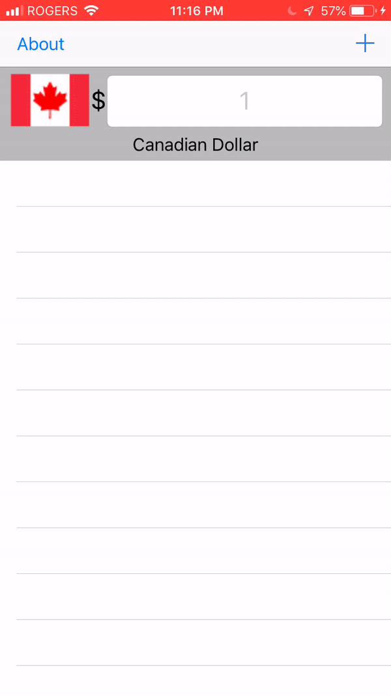

# Currency Converter

Simple, easy to use converter between 50+ currencies

## Features
* Choose any base currency you want
* Choose any currency to convert to
* Auto refreshing and pull to refresh to ensure you have the most up to date information
* Swipe to remove currencies you are no longer using

Second iOS app, with the knowledge of previous experience to incorporate custom cells, api calls, refreshing, and segues.

//
//  Created by John David Anthony on 2018-08-30.
//  Copyright © 2018 John David Anthony. All rights reserved.
//
